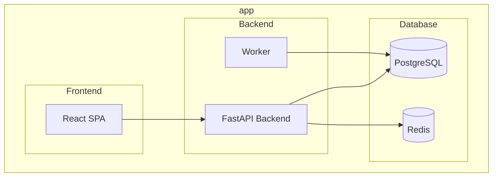

# Aplikacja do tworzenia i udostępniania ankiet, głosowań

## 🌐 Architektura aplikacji
**Frontend:** React (JS)\
**Backend:** FastAPI (Python)\
**Baza danych:** PostgreSQL + Redis

---


## Run project with docker compose

```
$ docker compose up
```

## Prepare ubuntu for playwright tests

```
$ sudo apt install x11-xserver-utils
$ xhost +local:docker
```

## Run frontend tests with playwright

```
$ docker compose run frontend_tests