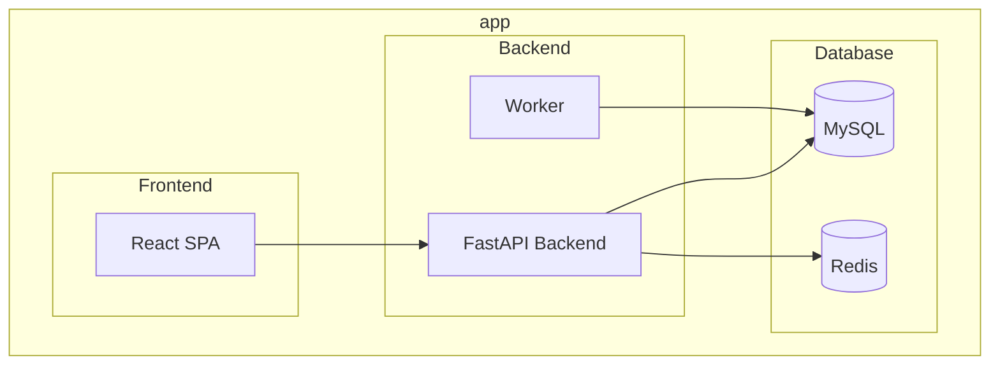

# Aplikacja do tworzenia i udostępniania ankiet, głosowań

## 🌠Architektura aplikacji
**Frontend:** React (JS)\
**Backend:** FastAPI (Python)\
**Baza danych:** MySQL + Redis

---

```mermaid
graph TB
  %% Każdy subgraph = 1 kontener
  subgraph app
    subgraph react["Frontend"]
      R[React SPA]
    end

    subgraph backend["Backend"]
      B[FastAPI Backend]
      W[Worker]
    end

    subgraph postgres["Database"]
      PG[(MySQL)]
      RD[(Redis)]
    end
  end

  R --> B
  B --> PG
  B --> RD
  W --> PG
```